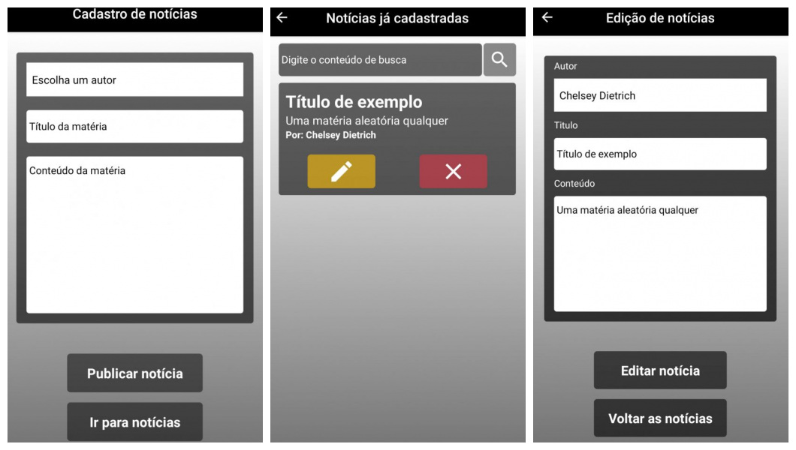

<h1 align="center">
	Journalist App
</h1>

 

  

<h4 align="center">
  Guilherme Fünkler Borelli
</h4>

  <a href="#wrench-tecnologias">Tecnologias</a>&nbsp;&nbsp;&nbsp;|&nbsp;&nbsp;&nbsp;
  <a href="#-projeto">Projeto</a>&nbsp;&nbsp;&nbsp;|&nbsp;&nbsp;&nbsp;
  <a href="#-instruções">Instruções</a>

## Tecnologias :wrench:  

Esse projeto foi desenvolvido com as seguintes tecnologias:

- [React](https://reactjs.org)
- [React Native](https://reactnative.dev/)
- [Redux](https://redux.js.org/)
- [Redux-Saga](https://redux-saga.js.org/)
- [Reactotron](https://github.com/infinitered/reactotron)
- [Styled Components](https://styled-components.com/)
- Diversas bibliotecas como React Native Vector Icons, Immer e etc

## Projeto 💻  

O projeto visa simular o front-end mobile de um sistema para cadastro notícias.

## Instruções 📚  

Para rodar a aplicação é necessário ter o ambiente configurado para projetos em React Native utilizar o comando 'yarn' ou 'npm i' (o que você utilizar) no diretório 'flexChallenge', após concluída a instalação dos pacotes utilize o comando 'adb reverse tcp:9090 tcp:9090' para que o Reactotron funcione corretamente, no diretório 'flexChallenge' utilizar o comando 'yarn' ou 'npx' (o que você utilizar) + 'react-native run-android', a aplicação iniciará automaticamente.
